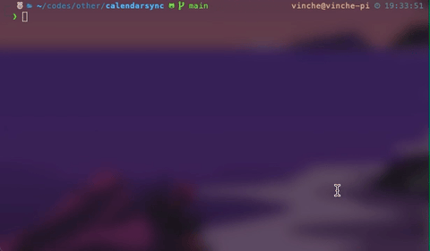

# CVV-CalendarSync

Un programma Python che sincronizza il tuo calendario di Classeviva nel tuo Google Calendar in modo da avere tutti i tuoi eventi e compiti in un unico posto.

Utilizza la libreria [`aiocvv`](https://github.com/Vinchethescript/aiocvv) per ottenere note, eventi e compiti da Classeviva e l'API di Google per sincronizzarli nel tuo Google Calendar.

## Installazione e utilizzo
1. Clona il repository;
2. Installa i pacchetti richiesti con `pip install -Ur requirements.txt`;
3. [Crea un nuovo progetto sulla Google Cloud Platform](https://developers.google.com/calendar/api/quickstart/python) e scarica il file `credentials.json` nella root del repository;
5. Copia il file `example.env` in `.env` e imposta le credenziali per Classeviva;
6. Per eseguirlo, esegui il file `main.py` con il tuo interpreter Python preferito;
7. Se lo stai eseguendo per la prima volta, ti verrà chiesto di autenticarti con Google e Classeviva. Segui le istruzioni sul terminale;
8. Controlla il tuo calendario!

Semplice, no?

> **Nota**: Questo programma funzionerà solo mentre l'anno scolastico è attivo. Quando l'anno finisce, otterrai un errore perché `end must be greater than start` (la data di fine deve essere maggiore della data d'inizio). Se vuoi comunque provarlo, puoi impostare la variabile d'ambiente `FULL_YEAR` su 1 nel file `.env`, in modo che il programma sincronizzerà tutti gli eventi dall'inizio dell'anno. Ad esempio, se sei nel 2024, sincronizzerà tutti gli eventi nell'anno scolastico 2023/2024. 